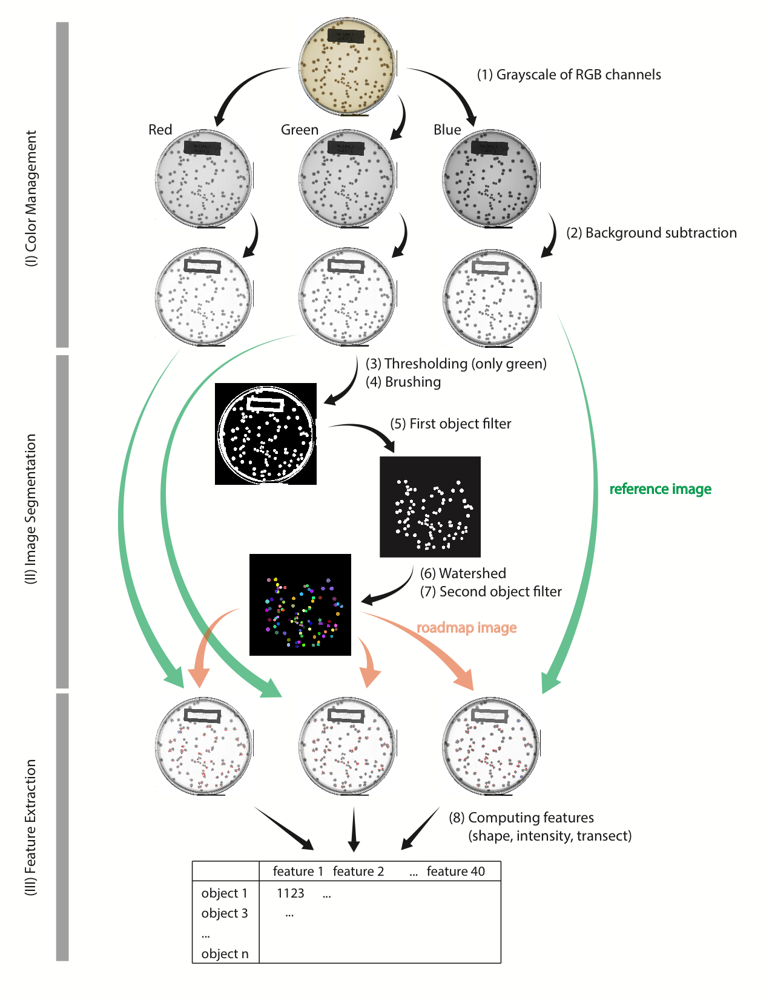

Scripts for the preprint entitled [Emergent coexistence in multispecies microbial communities](https://www.biorxiv.org/content/10.1101/2022.05.20.492860v2)


This repository includes three types of scripts for:

1. Command-line tools for image segmentation and random forest classification
2. Implementing analyses including 16S sequences, bootstrapping, and networks
3. Generating the figures for main text and supplements, as well as the supplementary PDFs


# Cloning this repository

Change the current working directory to the location where you want the cloned directory

```
$ cd /directory/to/where/you/want/
$ git clone https://github.com/Chang-Yu-Chang/emergent-coexistence
```

# Downloading the raw data to Dropbox

- `pipeline/` stores both the raw and temporary images. For this project, a minimum space of 200 GB is required. [Dropbox link](https://www.dropbox.com/sh/he4ekndjew60kot/AAAUCWZp3GeUOgOPQKc6MT1Ma?dl=0)
- `data/` stores the raw data from sequencing and OD, as well as the processed image data. These data are csv or Rdata formats. [Dropbox link](https://www.dropbox.com/sh/oec7rz4wvmlitrp/AADFUvMF9Xzj4LLmzUmjPMJTa?dl=0)


# Dependency


Python environment

```
```

R environment

```
BiocManager::install("Biostrings")
```

# Setup to reproduce the analysis

## Step 0.1 Specifying metadata

`00-metadata.R` stores all metadata used for analysis, including the folder directory, pipeline scripts, feature names, etc.

Edit this script to specify three folders for the scripts to work:

- `folder_script` is the directory of analysis scripts
- `folder_pipeline` is the full path directory of `pipeline/` described above.
- `folder_data` is the full path directory of `data/` described above. 

For this project on my local end, I specified the directory as followed. I will abbreviate the directory `"~/Desktop/lab/emergent-coexistence/analysis/"` into `"analysis/`, otherwise the full path is specified if I refer to another directory.

```
> folder_script <- "~/Desktop/lab/emergent-coexistence/analysis/" 
> folder_pipeline <- "~/Dropbox/lab/emergent-coexistence/pipeline/" 
> folder_data <- "~/Dropbox/lab/emergent-coexistence/data/"
```


## Step 0.2 Generating folder structure and mapping files

Once the directories are specified, navigate to `analysis/` and execute the following scripts to set up the subfolders in `folder_pipeline` for image processing pipeline, mapping files, and ID for pairs and cocultures.

```
$ cd analysis/
$ Rscript 00a-folder_structure.R
$ Rscript 00b-generate_mapping_files.R
$ Rscript 00c-generate_pairs_ID.R
$ Rscript 00d-assemble_colony_images.R # for making figure S5
```

Two groups of mapping files are generated:

- `00-list_images-BATCH-CHANNEL.csv`: is used for image processing. Each row represents one image file, and the columns specify the directory where temporary image files are stored. For example `00-list_images-B2-blue.csv` is for blue channel of images from batch B2.
- `00-list_image_mapping-BATCH.csv`: is used for matching coculture to monocultures. Each row is one coculture pair and the columns specify the batch, community, isolates, mixing frequencies, and the image file name of both isolates. For example `00-list_image_mapping-B2.csv` matches the cocultures to monocultures in batch B2.


## Step 1. Command-line tools

These scripts are wrapped into command-line tools that takes the mapping files stored in `analysis/mapping_files/` as input. All temporary output images and data are stored in the subfolders under `folder_pipeline`.

For instance, implementing the image processing pipeline and random forest classification for all cocultures in the batch B2 requires executing the following scripts in order.

```
$ cd analysis/
$ Rscript 01-channel.R mapping_files/00-list_images-B2-red.csv
$ Rscript 01-channel.R mapping_files/00-list_images-B2-green.csv
$ Rscript 01-channel.R mapping_files/00-list_images-B2-blue.csv
$ python 02-rolling_ball.py mapping_files/00-list_images-B2-red.csv # background subtration takes long
$ python 02-rolling_ball.py mapping_files/00-list_images-B2-green.csv
$ python 02-rolling_ball.py mapping_files/00-list_images-B2-blue.csv
$ Rscript 03-segmentation.R mapping_files/00-list_images-B2-green.csv
$ Rscript 04-feature.R mapping_files/00-list_images-B2-red.csv
$ Rscript 04-feature.R mapping_files/00-list_images-B2-green.csv
$ Rscript 04-feature.R mapping_files/00-list_images-B2-blue.csv
$ Rscript 04a-merge_features.R mapping_files/00-list_images-B2-green.csv
$ Rscript 05-random_forest.R mapping_files/00-list_images-B2-green.csv mapping_files/00-list_image_mapping-B2.csv
```

Below is the overview for the image processing pipeline




## Step 2. Data wrangling and analysis

In this step, we take data from either the 16S sequences or those data generated from the command-line as described above. These data are cleaned up and stored in the folder `~/Dropbox/lab/emergent-coexistence/data/temp/` with the file name prefix matched to the numbered script that generates it.

From the raw `.ab1` of 16S Sanger sequences, we aligned the raw reads, identified isolate taxonomy, and matched the community amplicon sequences (ESVs). See the Methods section for details. The following scripts do what has described.

```
$ cd analysis/
$ Rscript 11-align_isolate_sequences.R
$ Rscript 12-assign_isolate_RDP.R
$ Rscript 13-match_community_abundance.R
$ Rscript 14-pairwise_16s_mismatch.py
$ Rscript 15-samebug_pairs.R
$ Rscript 16-match_pair_RDP.R
```

Once the image processing and sequence analysis are done, we extracted the Random Forest model accuracy, compared the machine results to human results, as well as determined the pairwise competition outcome through bootstrapping. These results are appended to one two processed tables: `isolates` with 68 row representing isolates and `pairs` with 186 row representing species pairs.


```
$ Rscript 91-model_accuracy.R
$ Rscript 92-compare_machine_human.R
$ Rscript 93-determine_competition.R
$ Rscript 94-append_data.R
```

We generated network objects for plotting the competitive networks as well as calculating the network hierarchy.

```
$ Rscript 95-randomize_networks.R
```


## Step 3. Generating the figures and supplementary PDFs

Finally, with the processed tabular data and networks, we made Figure 1-4, Supplementary Figures S4-6, and Supplementary Tables S1-4 using the following scripts.

```
$ cd analysis/
$ Rscript 96-figures.R
$ Rscript 96a-supp_figures.R
```

Cartoons and Fig.S1-2 are generated using Adobe Illustrator.

The four supplementary PDFs that contain the images and random forest results are generated using the script. The command-line function `convert` is from `imagemagick`. An example of one page in these PDFs is shown in Figure S3.

```
$ cd analysis/
$ Rscript 97-combine_images_and_random_forest.R

# Once the individual pngs are generated, merge them into multi-page PDFs
$ cd ~/Dropbox/lab/emergent-coexistence/plate_scan_pipeline/random_forest/
$ convert -quality 60 B2_*.png random_forest-B2.pdf
$ convert -quality 60 C_*.png random_forest-C.pdf
$ convert -quality 60 C2_*.png random_forest-C2.pdf
$ convert -quality 60 D_*.png random_forest-D.pdf
```

## Sum up

To execute all steps decribed above, from the raw data to ready-for-paper figures, basically run all scripts using terminal commands saved in a master shell script `analysis/00e-commands.sh`. Note that for the shell script to work, the working directory has to be the project directory (where `emergent-coexistence.Rproj` is located)

```
$ Rscrip analysis/99-generate_commands.R
$ zsh analysis/99a-commands.sh
```


