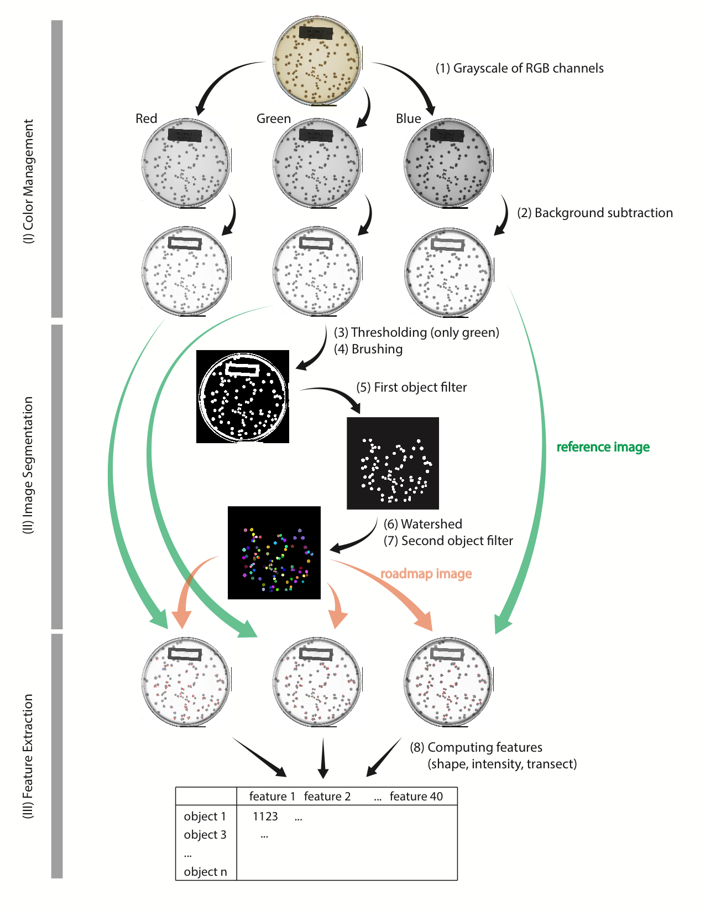

Scripts and data for the manuscript entitled "Emergent coexistence in multispecies microbial communities"

# Environment

The scripts included in this repository have been tested under the following R environment

```
> sessionInfo()
R version 4.2.2 (2022-10-31)
Platform: aarch64-apple-darwin20 (64-bit)
Running under: macOS Ventura 13.4

Matrix products: default
LAPACK: /Library/Frameworks/R.framework/Versions/4.2-arm64/Resources/lib/libRlapack.dylib

locale:
[1] en_US.UTF-8/en_US.UTF-8/en_US.UTF-8/C/en_US.UTF-8/en_US.UTF-8

attached base packages:
[1] stats     graphics  grDevices utils     datasets  methods   base     

loaded via a namespace (and not attached):
[1] compiler_4.2.2  tools_4.2.2     rstudioapi_0.14
```

For various purposes, parts of the following R packages are loaded in the corresponding scripts.

```
tidyverse_2.0.0             # for general anaylsis
readr_2.1.4                 # for general anaylsis
data.table_1.14.8           # for general anaylsis
broom_1.0.4                 # for tidying the statistic results
sangeranalyseR_1.8.0        # for aligning Sanger reads
rRDPData_1.18.0             # for assigning isolate taxonomy
rRDP_1.32.0                 # for assigning isolate taxonomy
Biostrings_2.66.0           # for handling DNA string and ESV-Sanger alignment
EBImage_4.40.0              # for image processing
EBImageExtra_0.0.0.2        # for image processing
randomForest_4.7-1.1        # for executing random forest
caret_6.0-94                # for streamlining the model training
cowplot_1.1.1               # for assembling figures
magick_2.7.4                # for merging png from a folder into a single pdf
igraph_1.4.1                # for computing network motifs
ggraph_2.1.0                # for visualizing networks
tidygraph_1.2.3             # for handling network data
grid                        # based R package for drawing polygons
ggstats_0.2.1               # for extension to ggplot2 for plotting stats
officer_0.6.2               # for handling tables
flextable_0.9.0             # for handling tables
```

The python scripts have been tested under the python version

```
❯ python --version
Python 3.11.3
```

The version of the python packages used 

```
numpy           1.24.3      # for general analysis
pandas          2.0.2       # for general analysis
scikit-image    0.20.0      # for rolling ball algorithm (removing image background)
biopython       1.81        # for merging paired sequences
```

# Data

`pipeline/` stores the original colony plate images (TIFF), the processed images (i.e., grey-scaled images, background subtracted images, segmented images), object features (CSV), random forest results (CSV)

`data/` stores all other datasets. It includes three folders: 

- `raw`: includes sequences, ESV table, human colony counts, isolate growth rate, and OD. These data are CSV or AB1 for sequences
    - `isolates1.csv` is the mapping file for 65 isolates
    - `pairs_freq_human.csv` is the human count result of the coculture images
    - `community_ESV/` contains the otu table, metadata, and ESV taxonomy originally published in Goldford et al 2018 (DOI: 10.1126/science.aat1168) and curated in Vila et al 2020 (DOI: 10.1038/s41396-020-0702-7), retrieved from Zenodo (DOI: 10.5281/zenodo.3817698)
    - `growth_rate/` contains the monoculture growth rate data  published in ref Estrela et al 2022 (DOI: 10.1016/j.cels.2021.09.011) and retrieved from Zenodo (DOI: 10.5281/zenodo.5510318)
    - `OD/` contains the OD data measured in the pairwise competition experiments, including the OD of both monocultures and cocultures
    - `sanger/` contains the raw 16S rRNA Sanger sequences of isolates
- `temp`: includes processed CSV. The file name is numbered corresponding to the script that generates it. 
    - `00c-communities.csv` is the mapping file for 12 communities
    - `00c-isolates_ID.csv` is the mapping file for 65 isolates
    - `00c-pairs_freq_ID.csv` is the mapping file for 477 pairwise competition experiments
    - `06-isolates_epsilon.csv` contains the OD, CFU, epsilon of 65 isolates
    - `06-pairs_T0.csv` contains OD-to-CFU at T0 for 477 cocultures
    - `06-pairs_T8.csv` contains CFU counts at T8 for 459 cocultures
    - `07-pairs_boots.csv` is the bootstrapped the T0 and T8 pairwise data
    - `11-isolates_16S.csv` includes the Sanger sequences of 65 strains
    - `12-isolates_RDP.csv` includes the RDP taxonomy of 65 strains
    - `13-communities_abundance_T0.csv` is the community composition of T0 environmental samples. It is used to generate FigS1A
    - `13-rarefaction.csv` contains the rarefaction richness of T0 samples. It is used to generate FigS1B
    - `13-emergent_communities.csv` contains the communities (assembled in glucose, leucine, and citrate) from Goldford et al 2018 and Vila et al 2020. It is identical to `Emergent_Comunity_Data.csv` on https://zenodo.org/record/3817698 
    - `14-communities_abundance.csv` is a subset of `13-emergent_communities.csv` which only contains glucose communities
    - `15-eq_freq_stable.csv` includes the empirical and predicted equilibrium of 99 ESVs present at the 26 stable communities
    - `15-eq_freq_transient2.csv` includes the predicted equilibrium of 46 transient ESVs that have >= 5 data points
    - `15-eq_freq_transient.csv` includes the predicted equilibrium of 110 transient ESVs that have >= 3 data points
    - `15-fitness_stable.csv` contains the invasion fitness of 99 ESVs at different transfers
    - `15-fitness_transient.csv` contains the invasion fitness of 46 transient ESVs that have >= 5 data points at different transfers
    - `15-fitness_transient2.csv` contains the invasion fitness of 110 transient ESVs that have >= 3 data points at different transfers
    - `16-sequences_alignment.csv` has all 599 possible alignments between ESV and Sanger within the 12 communities
    - `16-isolates_abundance.csv` has the 62 isolates each with matched ESV abundance
    - `21-mismatch_matrix_communities.csv` has the matrix of pairwise mismatch between isolate Sangers
    - `22-pairs_mismatch.csv` is the long format of `21-mismatch_matrix_communities.csv`
    - `23-pairs_RDP.csv` contains the RDP taxonomy of isolates specified for 159 pairs
    - `24-accuracy.csv` contains the accuracy data for 459 cocultures with colony counts
    - `24-pairs_accuracy.csv` contains the mean accuracy for each of 153 pairs
    - `25-pairs_freq.csv` contains the 936 coculture data. 477 at T0 and 459 at T8
    - `25-pairs_mean_eq_measures.csv` contains the mean equilibrium frequency of 153 pairs with colony count. It is used to make Fig2B
    - `26-pairs_outcome.csv` has the pairwise competition outcome of 153 pairs
    - `27-pairs_freq_machine_human.csv` contains the 459 cocultures with either human count, machine count, or both
    
- `output`: includes the seven main datasets
    - `communities.csv` 12 communities 
    - `isolates.csv` contains 65 initial isolates
    - `pairs.csv` contains 159 initial pairs
    - `communities_remained.csv` contains 12 communities reordered according to the number of isolates after removing three isolates with bad alignment
    - `isolates_remained.csv` has 62 isolates after removing three isolates with bad alignment
    - `pairs_remained.csv` has 144 pairs after removing the 6 pairs with no colony, and 9 with low random forest model accuracy


# Scripts

This repository includes three types of scripts:

1. `image_scripts/` contains command-line tools for image segmentation and random forest classification. The resulting processed images and random forest CSV are stored in `pipeline/`
    - `mapping_files/` contains the mapping files for executing image processing
    - `00a-folder_structure` creates the folder structure associated with the image processing pipeline under `pipeline/`. This is necessary for the processed images to be stored.
    - `00b-generate_mapping_files` generates the mapping csv stored in `mapping_files/`
    - `01-channel.R` is a command-line tool for extracting the three color channels from the RGB images
    - `02-rolling_ball.py` is a command-line tool for subtracting the background of a grey-scale image using rolling ball algorithm
    - `03-segmentation.R` is a command-line tool for segmenting an image (default input should be the green channel) by performing thresholding, brushing, object filter, and watershed
    - `04-feature.R` is a command-line tool for computing the object features using 1) a roadmap image and 2) a reference image
    - `04a-merge_features.R` combines the three features table from R G B into one table
    - `05-random_forest.R` is a command-line tool for performing random forest. It takes both the list of coculture images and mapping between coculture and monoculture images

2. `processing_scripts/` processes the data from `data/raw` and `pipeline/`. Each script and its processed data are numbered accordingly. The processed data are stored in `data/temp/`
    - `00-metadata.R` 
    - `00c-generate_ID.R` generates the list of communities, isolates, pairs
    - `00d-assemble_colony_images.R` reads the colony position from feature/ and crop one colony out from the original images. The cropped images are later assembled into Fig S6 using Illustrator
    - `00e-combine_image_and_random_forest.R` combines the plate images with the random forest results. The resulting is `pipeline/random_forest/`
    - `06-aggregate_T0_T8_data.R` converts the T0 OD to CFU using monoculture data (OD and machine count CFU) and aggregates the machine counts of T8 cocultures
    - `07-bootstrapping.R` bootstraps T0 and T8 pairwise data
    - `11-align_isolate_Sanger.R` aligns raw Sanger sequences of isolates
    - `12-assign_isolate_RDP.R` reads isolate 16S sequences and assigns taxonomy using RDP
    - `13-rarefaction.R` performs rarefaction. The script is adapted from the rarefaction script in Vila et al 2020
    - `14-filter_community_abundance.R` subsets only the glucose communities which are relevant to the current study
    - `15-calculate_invasion_fitness.R` calculates the invasion fitness for ESVs from the 26 glucose communities that have temporal data
    - `16-align_ESV_Sanger.R` aligns the isolate Sanger and community ESV within the 12 communities
    - `21-pairwise_16s_mismatch.py` runs merging paired sequences from Genewiz 
    - `22-detect_samebug_pairs.R` makes a long format of pairwise mismatch between pairs of isolate sanger sequences
    - `23-match_pairs_RDP.R` matches the isolates' 16S and RDP to pairs
    - `24-model_accuracy.R` aggregates the random forest model prediction values and accuracy
    - `25-calculate_pairs_frequency.R` reads the bootstrapped pairs T0 and T8 results into a pairs_freq table and calculates the mean, 5th and 95th percentile of the pairwise data
    - `26-determine_competition_outcomes.R` determines the pairwise competition outcome 
    - `27-compare_machine_human.R` compares the random forest prediction to the human eye counts
    - `28-combine_images_and_random_forest.R` combines the images and random forest result for cocultures in `pipeline/random_forest/`
    - `99-append_data.R` appends all isolate and pair data and store in `data/output/`

3. `plotting_scripts/`: generates the figures for main text and supplements. The resulting figures are stored in `plots/`. The main figures have both PNG and PDF with final touch in Illustrator. Fig1 cartoon, Fig2A, Figs S6, S8, and S9 were generated completely in Illustrator.


# Specifying directory in metadata

`processing_scripts/00-metadata.R` stores all metadata used for analysis, including the folder directory, pipeline scripts, feature names, etc.

Edit this script to specify three folders for the scripts to work:

- `folder_script` is the directory of processing scripts `processing_scripts/`
- `folder_pipeline` is the full path directory of `pipeline/` described above
- `folder_data` is the full path directory of `data/` described above

```
> folder_script <- "processing_scripts/" 
> folder_pipeline <- "pipeline/" 
> folder_data <- "data/"
```

# Image processing

### Generating folder structure and mapping files

Once the directories are specified, navigate to `image_scripts/` and execute the following scripts to set up the subfolders in `pipeline/` for image processing and mapping files.

```
cd image_scripts/
mkdir mapping_files/
Rscript 00a-folder_structure.R
Rscript 00b-generate_mapping_files.R
```

Two groups of mapping files are generated:

- `00-list_images-BATCH-CHANNEL.csv`: is used for image processing. Each row represents one image file, and the columns specify the directory where temporary image files are stored. For example `00-list_images-B2-blue.csv` is the mapping file for processing the blue channels of images from batch B2.
- `00-list_image_mapping-BATCH.csv`: is used for matching coculture to monocultures. Each row is one coculture pair and the columns specify the batch, community, isolates, mixing frequencies, and the image file name of both isolates. For example `00-list_image_mapping-B2.csv` matches the cocultures to monocultures in batch B2. This mapping file is only used for random forest.


### Command-line tools

The scripts for image files are wrapped into command-line tools that takes the mapping files stored in `image_scripts/mapping_files/` as input. All temporary output images and data are stored in the subfolders under `pipeline/images/`.

For instance, implementing the image processing pipeline and random forest classification for all cocultures in the batch B2 requires executing the following scripts in order.

```
cd image_scripts
Rscript 01-channel.R mapping_files/00-list_images-B2-red.csv
Rscript 01-channel.R mapping_files/00-list_images-B2-green.csv
Rscript 01-channel.R mapping_files/00-list_images-B2-blue.csv
python 02-rolling_ball.py mapping_files/00-list_images-B2-red.csv
python 02-rolling_ball.py mapping_files/00-list_images-B2-green.csv
python 02-rolling_ball.py mapping_files/00-list_images-B2-blue.csv
Rscript 03-segmentation.R mapping_files/00-list_images-B2-green.csv
Rscript 04-feature.R mapping_files/00-list_images-B2-red.csv
Rscript 04-feature.R mapping_files/00-list_images-B2-green.csv
Rscript 04-feature.R mapping_files/00-list_images-B2-blue.csv
Rscript 04a-merge_features.R mapping_files/00-list_images-B2-green.csv
Rscript 05-random_forest.R mapping_files/00-list_images-B2-green.csv mapping_files/00-list_image_mapping-B2.csv
```

Below is the overview for the image processing pipeline. The resulting dataset such as the object features are stored in `BATCH-07-feature/` and the random forest results are stored in `BATCH-08-random_forest/`. These csv are later aggregated using the scripts below.




